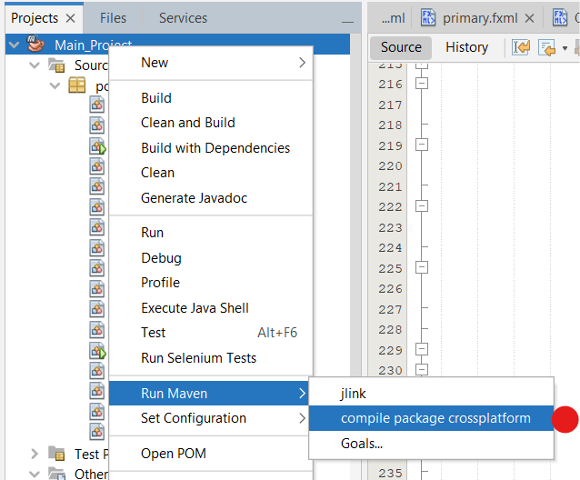

# Authentification
ID: **`bachir`**

Password: **`bachir2023`**

# Notes d'Usage
> Note 1: Appuyer sur entre 1 fois aprés chaque saisi ou choix de réference dans l'achat ou la vente.

# Cross-Platform JavaFX App
Ce projet utilise [maven-shade-plugin](https://maven.apache.org/plugins/maven-shade-plugin/) pour compiler un [Cross-Platform FAT-JAR](https://openjfx.io/openjfx-docs/#modular) executable sur Win/Linux/MacOs.

## Usage

- Vous pouvez générer le fichier JAR exécutable du projet à partir de n'importe quel système d'exploitation:
    ```
    $ mvn clean compile package
    ```
    > Cette commande est aussi définie dans `nbactions.xml` et peut peut-être executé directement depuis NetBeans... 


- le JAR sera généré dans le dossier `shade`,

- puis exécutez-le sur n'importe quel système d'exploitation:
    ```
    $ java -jar shade/Main_Project.jar 
    ```

    > Sur Windows, le fichier est exécutable par un simple double-click !